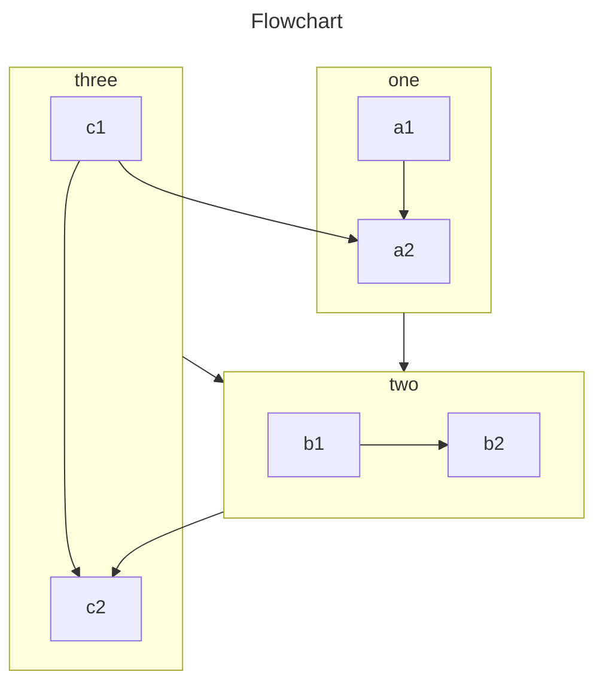

:::tip
本文介绍一些本博客可自用的Markdown稀奇古怪用法，不一定适用所有环境
:::

## 选项卡

```markdown
::: tip
这是一个提示框
:::
```

::: tip
这是一个提示框
:::

```markdown
::: info
这是一个信息框
:::
```

::: info
这是一个信息框
:::

```markdown
::: warning 
这是一个警告框
:::
```

::: warning
这是一个警告框
:::

```markdown
::: details 
详情容器
:::
```

::: details
详情容器
:::


```markdown
::: tabs

@tab 标题 1

<!-- tab 1 内容 -->

@tab 标题 2

<!-- tab 2 内容 -->

@tab:active 标题 3

<!-- tab 3 将会被默认激活 -->

<!-- tab 3 内容 -->

:::
```

::: tabs
@tab apple
apple
@tab banana
banana
@tab:active watermelon
watermelon
:::

## [Emoji](https://github.com/ikatyang/emoji-cheat-sheet)

可以通过在Markdown内容中输入`:EMOJICODE:`来添加Emoji表情

#### :heart:

| ico | shortcode | ico | shortcode | ico | shortcode |
| :-: | :-: | :-: | :-: | :-: | :-: |
| :joy: | `:joy:`  | :smiley: | `:smiley:` | :sweat_smile: | `:sweat_smile:` |
| :rofl: | `:rofl:` | :joy: | `:joy:` |:heart_eyes: | `:heart_eyes:` |
| :slightly_smiling_face: | `:slightly_smiling_face:` | :smiling_face_with_three_hearts: | `:smiling_face_with_three_hearts:` |:upside_down_face: | `:upside_down_face:` |
| :innocent: | `:innocent:` | :kissing: | `:kissing:` |:smirk: | `:smirk:` |
| :sleeping: | `:sleeping:` | :cowboy_hat_face: | `:cowboy_hat_face:` | :partying_face: | `:partying_face:` |
| :sob: | `:sob:` | :smiling_imp: | `:smiling_imp:` | :skull_and_crossbones: | `:skull_and_crossbones:` |
| :hankey: | `:shit:` | :clown_face: | `:clown_face:` | :japanese_goblin: | `:japanese_goblin:` |
| :ghost: | `:ghost:` | :space_invader: | `:space_invader:` | :robot: | `:robot:` |
| :see_no_evil: | `:see_no_evil:` | :hear_no_evil: | `:hear_no_evil:` | :speak_no_evil: | `:speak_no_evil:` |
| :cupid: | `:cupid:` | :sparkling_heart: | `:sparkling_heart:` | :two_hearts: | `:two_hearts:` |
| :broken_heart: | `:broken_heart:` | :yellow_heart: | `:yellow_heart:` | :blue_heart: | `:blue_heart:` |
| :anger: | `:anger:` | :boom: | `:boom:` | :zzz: | `:zzz:` |

## 目录

如果想把当前页面添加到Markdown内容中，可输入`[[toc]]`

[[toc]]

## 标记

使用` == == `进行 ==标记== 

## [Chart](https://plugin-md-enhance.vuejs.press/zh/guide/chart/chartjs.html)
````
::: chart 一个块状图案例

```json
{
  "type": "bar",
  "data": {
    "labels": ["红色", "蓝色", "黄色", "绿色", "紫色", "橙色"],
    "datasets": [
      {
        "label": "投票数",
        "data": [12, 19, 3, 5, 2, 3],
        "backgroundColor": [
          "rgba(255, 99, 132, 0.2)",
          "rgba(54, 162, 235, 0.2)",
          "rgba(255, 206, 86, 0.2)",
          "rgba(75, 192, 192, 0.2)",
          "rgba(153, 102, 255, 0.2)",
          "rgba(255, 159, 64, 0.2)"
        ],
        "borderColor": [
          "rgba(255, 99, 132, 1)",
          "rgba(54, 162, 235, 1)",
          "rgba(255, 206, 86, 1)",
          "rgba(75, 192, 192, 1)",
          "rgba(153, 102, 255, 1)",
          "rgba(255, 159, 64, 1)"
        ],
        "borderWidth": 1
      }
    ]
  },
  "options": {
    "scales": {
      "y": {
        "beginAtZero": true
      }
    }
  }
}
```

:::
````

::: chart 一个块状图案例
```json
{
  "type": "bar",
  "data": {
    "labels": ["红色", "蓝色", "黄色", "绿色", "紫色", "橙色"],
    "datasets": [
      {
        "label": "投票数",
        "data": [12, 19, 3, 5, 2, 3],
        "backgroundColor": [
          "rgba(255, 99, 132, 0.2)",
          "rgba(54, 162, 235, 0.2)",
          "rgba(255, 206, 86, 0.2)",
          "rgba(75, 192, 192, 0.2)",
          "rgba(153, 102, 255, 0.2)",
          "rgba(255, 159, 64, 0.2)"
        ],
        "borderColor": [
          "rgba(255, 99, 132, 1)",
          "rgba(54, 162, 235, 1)",
          "rgba(255, 206, 86, 1)",
          "rgba(75, 192, 192, 1)",
          "rgba(153, 102, 255, 1)",
          "rgba(255, 159, 64, 1)"
        ],
        "borderWidth": 1
      }
    ]
  },
  "options": {
    "scales": {
      "y": {
        "beginAtZero": true
      }
    }
  }
}
```
:::


````
::: chart 一个线状图案例

```json
{
  "type": "line",
  "data": {
    "labels": ["一月", "二月", "三月", "四月", "五月", "六月", "七月"],
    "datasets": [
      {
        "label": "我的第一个数据集",
        "data": [65, 59, 80, 81, 56, 55, 40],
        "fill": false,
        "borderColor": "rgb(75, 192, 192)",
        "tension": 0.1
      }
    ]
  }
}
```

:::
````

::: chart 一个线状图案例
```json
{
  "type": "line",
  "data": {
    "labels": ["一月", "二月", "三月", "四月", "五月", "六月", "七月"],
    "datasets": [
      {
        "label": "我的第一个数据集",
        "data": [65, 59, 80, 81, 56, 55, 40],
        "fill": false,
        "borderColor": "rgb(75, 192, 192)",
        "tension": 0.1
      }
    ]
  }
}
```
:::

````
::: chart 一个玫瑰图案例

```json
{
  "type": "polarArea",
  "data": {
    "labels": ["红色", "绿色", "黄色", "灰色", "蓝色"],
    "datasets": [
      {
        "label": "我的第一个数据集",
        "data": [11, 16, 7, 3, 14],
        "backgroundColor": [
          "rgb(255, 99, 132)",
          "rgb(75, 192, 192)",
          "rgb(255, 205, 86)",
          "rgb(201, 203, 207)",
          "rgb(54, 162, 235)"
        ]
      }
    ]
  }
}
```

:::
````

::: chart 一个玫瑰图案例
```json
{
  "type": "polarArea",
  "data": {
    "labels": ["红色", "绿色", "黄色", "灰色", "蓝色"],
    "datasets": [
      {
        "label": "我的第一个数据集",
        "data": [11, 16, 7, 3, 14],
        "backgroundColor": [
          "rgb(255, 99, 132)",
          "rgb(75, 192, 192)",
          "rgb(255, 205, 86)",
          "rgb(201, 203, 207)",
          "rgb(54, 162, 235)"
        ]
      }
    ]
  }
}
```
:::

````
::: chart 一个雷达图案例

```json
{
  "type": "radar",
  "data": {
    "labels": ["吃饭", "喝水", "睡觉", "设计", "编程", "骑车", "跑步"],
    "datasets": [
      {
        "label": "我的第一个数据集",
        "data": [65, 59, 90, 81, 56, 55, 40],
        "fill": true,
        "backgroundColor": "rgba(255, 99, 132, 0.2)",
        "borderColor": "rgb(255, 99, 132)",
        "pointBackgroundColor": "rgb(255, 99, 132)",
        "pointBorderColor": "#fff",
        "pointHoverBackgroundColor": "#fff",
        "pointHoverBorderColor": "rgb(255, 99, 132)"
      },
      {
        "label": "我的第二个数据集",
        "data": [28, 48, 40, 19, 96, 27, 100],
        "fill": true,
        "backgroundColor": "rgba(54, 162, 235, 0.2)",
        "borderColor": "rgb(54, 162, 235)",
        "pointBackgroundColor": "rgb(54, 162, 235)",
        "pointBorderColor": "#fff",
        "pointHoverBackgroundColor": "#fff",
        "pointHoverBorderColor": "rgb(54, 162, 235)"
      }
    ]
  },
  "options": {
    "elements": {
      "line": {
        "borderWidth": 3
      }
    }
  }
}
```

:::
````

::: chart 一个雷达图案例
```json
{
  "type": "radar",
  "data": {
    "labels": ["吃饭", "喝水", "睡觉", "设计", "编程", "骑车", "跑步"],
    "datasets": [
      {
        "label": "我的第一个数据集",
        "data": [65, 59, 90, 81, 56, 55, 40],
        "fill": true,
        "backgroundColor": "rgba(255, 99, 132, 0.2)",
        "borderColor": "rgb(255, 99, 132)",
        "pointBackgroundColor": "rgb(255, 99, 132)",
        "pointBorderColor": "#fff",
        "pointHoverBackgroundColor": "#fff",
        "pointHoverBorderColor": "rgb(255, 99, 132)"
      },
      {
        "label": "我的第二个数据集",
        "data": [28, 48, 40, 19, 96, 27, 100],
        "fill": true,
        "backgroundColor": "rgba(54, 162, 235, 0.2)",
        "borderColor": "rgb(54, 162, 235)",
        "pointBackgroundColor": "rgb(54, 162, 235)",
        "pointBorderColor": "#fff",
        "pointHoverBackgroundColor": "#fff",
        "pointHoverBorderColor": "rgb(54, 162, 235)"
      }
    ]
  },
  "options": {
    "elements": {
      "line": {
        "borderWidth": 3
      }
    }
  }
}
```
:::

````
::: chart 一个散点图案例

```json
{
  "type": "scatter",
  "data": {
    "datasets": [
      {
        "label": "散点数据集",
        "data": [
          { "x": -10, "y": 0 },
          { "x": 0, "y": 10 },
          { "x": 10, "y": 5 },
          { "x": 0.5, "y": 5.5 }
        ],
        "backgroundColor": "rgb(255, 99, 132)"
      }
    ]
  },
  "options": {
    "scales": {
      "x": {
        "type": "linear",
        "position": "bottom"
      }
    }
  }
}
```

:::
````

::: chart 一个散点图案例
```json
{
  "type": "scatter",
  "data": {
    "datasets": [
      {
        "label": "散点数据集",
        "data": [
          { "x": -10, "y": 0 },
          { "x": 0, "y": 10 },
          { "x": 10, "y": 5 },
          { "x": 0.5, "y": 5.5 }
        ],
        "backgroundColor": "rgb(255, 99, 132)"
      }
    ]
  },
  "options": {
    "scales": {
      "x": {
        "type": "linear",
        "position": "bottom"
      }
    }
  }
}
```
:::

## [ECharts](https://plugin-md-enhance.vuejs.press/zh/guide/chart/echarts.html)

::: echarts Dynamic Data & Time Axis

```js
const oneDay = 86400000;
const data = [];
let now = new Date(1997, 9, 3);
let value = Math.random() * 1000;

const randomData = () => {
  now = new Date(+now + oneDay);
  value = value + Math.random() * 21 - 10;
  return {
    name: now.toString(),
    value: [
      [now.getFullYear(), now.getMonth() + 1, now.getDate()].join("/"),
      Math.round(value),
    ],
  };
};

for (let i = 0; i < 1000; i++) data.push(randomData());

const option = {
  tooltip: {
    trigger: "axis",
    formatter: function (params) {
      params = params[0];
      var date = new Date(params.name);
      return (
        date.getDate() +
        "/" +
        (date.getMonth() + 1) +
        "/" +
        date.getFullYear() +
        " : " +
        params.value[1]
      );
    },
    axisPointer: {
      animation: false,
    },
  },
  xAxis: {
    type: "time",
    splitLine: {
      show: false,
    },
  },
  yAxis: {
    type: "value",
    boundaryGap: [0, "100%"],
    splitLine: {
      show: false,
    },
  },
  toolbox: {
    show: true,
    feature: {
      mark: {
        show: true,
      },
      dataView: {
        show: true,
        readOnly: false,
      },
      restore: {
        show: true,
      },
      saveAsImage: {
        show: true,
      },
    },
  },
  series: [
    {
      name: "Fake Data",
      type: "line",
      showSymbol: false,
      data: data,
    },
  ],
};
const timeId = setInterval(() => {
  if (myChart._disposed) return clearInterval(timeId);

  for (let i = 0; i < 5; i++) {
    data.shift();
    data.push(randomData());
  }
  myChart.setOption({
    series: [
      {
        data: data,
      },
    ],
  });
}, 1000);
```

:::

@include-pop()

::: echarts A bar chart

```js
const data = [];

for (let i = 0; i < 5; i++) data.push(Math.round(Math.random() * 200));

const option = {
  xAxis: {
    max: "dataMax",
  },
  yAxis: {
    type: "category",
    data: ["A", "B", "C", "D", "E"],
    inverse: true,
    animationDuration: 300,
    animationDurationUpdate: 300,
    max: 2, // only the largest 3 bars will be displayed
  },
  series: [
    {
      realtimeSort: true,
      name: "X",
      type: "bar",
      data: data,
      label: {
        show: true,
        position: "right",
        valueAnimation: true,
      },
    },
  ],
  legend: {
    show: true,
  },
  toolbox: {
    show: true,
    feature: {
      mark: {
        show: true,
      },
      dataView: {
        show: true,
        readOnly: false,
      },
      restore: {
        show: true,
      },
      saveAsImage: {
        show: true,
      },
    },
  },
  animationDuration: 0,
  animationDurationUpdate: 3000,
  animationEasing: "linear",
  animationEasingUpdate: "linear",
};
const run = () => {
  for (let i = 0; i < data.length; i++)
    data[i] += Math.round(Math.random() * Math.random() > 0.9 ? 2000 : 200);

  myChart.setOption({
    series: [{ type: "bar", data }],
  });
};

const timeId = setInterval(() => {
  if (myChart._disposed) return clearInterval(timeId);

  run();
}, 3000);
```

:::


## [Mermaid](https://plugin-md-enhance.vuejs.press/zh/guide/chart/mermaid.html)
````

````


````
```sequence Greetings
Alice ->> Bob: Hello Bob, how are you?
Bob-->>John: How about you John?
Bob--x Alice: I am good thanks!
Bob-x John: I am good thanks!
Note right of John: Bob thinks a long<br/>long time, so long<br/>that the text does<br/>not fit on a row.

Bob-->Alice: Checking with John...
Alice->John: Yes... John, how are you?
```
````

```sequence Greetings
Alice ->> Bob: Hello Bob, how are you?
Bob-->>John: How about you John?
Bob--x Alice: I am good thanks!
Bob-x John: I am good thanks!
Note right of John: Bob thinks a long<br/>long time, so long<br/>that the text does<br/>not fit on a row.

Bob-->Alice: Checking with John...
Alice->John: Yes... John, how are you?
```

````
```pie
title What Voldemort doesn't have?
  "FRIENDS" : 2
  "FAMILY" : 3
  "NOSE" : 45
```
````

```pie
title What Voldemort doesn't have?
  "FRIENDS" : 2
  "FAMILY" : 3
  "NOSE" : 45
```

## [流程图](https://plugin-md-enhance.vuejs.press/zh/guide/chart/flowchart.html)

- 模块：start（原边长方形，表示开始）、end（圆边长方形，表示结束）、operation（长方形）、condition（菱形，选择条件）、subroutine、inputoutput（平行四边形，表示输入输出）
- 定义使用模块的语法 ：`名称`+`=>(英文符号)`+`:`+` `+`自定义框内文字`；
- 连线语法：模块之间使用`->`连接；判断条件在模块后面使用小括号内填写`yes`或`no`；连接方向在模块后面使用小括号内填写`left`或`right`
- `|`后面作注释

````
```flow
st=>start: 开始|past:>http://www.google.com[blank]
e=>end: 结束|future:>http://www.google.com
op1=>operation: 操作1|past
op2=>operation: 操作2|current
sub1=>subroutine: 子程序|invalid
cond=>condition: 是/否?|approved:>http://www.google.com
c2=>condition: 判断2|rejected
io=>inputoutput: 进行反思...|future

st->op1(right)->cond
cond(yes, right)->c2
cond(no)->sub1(left)->op1
c2(yes)->io->e
c2(no)->op2->e
```
````

```flow
st=>start: 开始|past:>http://www.google.com[blank]
e=>end: 结束|future:>http://www.google.com
op1=>operation: 操作1|past
op2=>operation: 操作2|current
sub1=>subroutine: 子程序|invalid
cond=>condition: 是/否?|approved:>http://www.google.com
c2=>condition: 判断2|rejected
io=>inputoutput: 进行反思...|future

st->op1(right)->cond
cond(yes, right)->c2
cond(no)->sub1(left)->op1
c2(yes)->io->e
c2(no)->op2->e
```

::: details 参考链接：  
1. [VH-Markdown增强](https://plugin-md-enhance.vuejs.press/zh/guide/)
2. [Oragekk:markdown展示](https://oragekk.me/demo/markdown.html)
:::